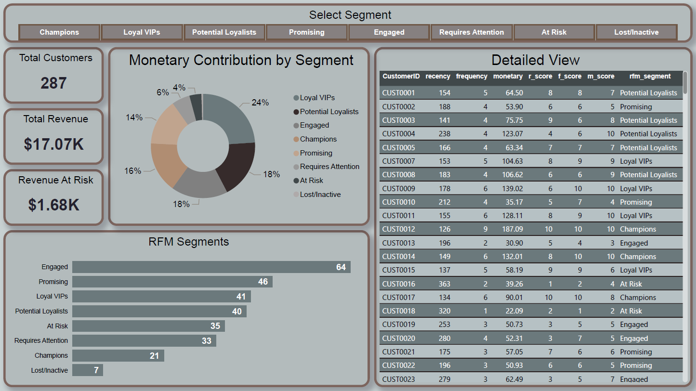

# RFM Customer Segmentation & Revenue Risk Analysis

## Project Overview
This project establishes an end-to-end analytics pipeline to segment a base of 287 customers using **RFM (Recency, Frequency, Monetary)** logic. By transitioning raw transaction data through a SQL-based ETL process in BigQuery, I identified that **$1.68K (approx. 10%) of total revenue** is currently tied to "At Risk" and "Lost" customer segments.

## Interactive Dashboard

*Click the image above to view the live interactive report.*

## Technical Stack
* **Data Warehouse:** Google BigQuery
* **Language:** SQL (CTEs, NTILE window functions, Case Logic)
* **Visualization:** Power BI (Data Modeling, UI/UX Design, DAX)

## The Data Pipeline (ETL)
The project follows a structured data transformation layer to ensure backend integrity:
1. **Source Data:** 12 Monthly Sales CSVs ingested into BigQuery.
2. **Data Consolidation:** Merged monthly shards into a master `sales_2025` table using wildcard unions.
3. **Transformation Layer:** Utilized SQL Views to calculate customer metrics and assign quintile scores (1-10) for Recency, Frequency, and Monetary values.
4. **Business Logic:** Implemented a scoring matrix to categorize customers into 8 distinct segments, ranging from "Champions" to "Lost/Inactive."

## Key Insights & Business Story
* **Revenue Protection:** Identified high-value customers who haven't shopped recently, highlighting $1.68K in revenue at risk of churn.
* **Volume vs. Value:** While **Loyal VIPs** drive 24% of revenue, the **Engaged** segment represents the largest customer volume, indicating a prime opportunity for conversion campaigns.
* **Functional UI/UX:** The dashboard is designed for self-service BI, allowing stakeholders to filter by segment and instantly retrieve a list of CustomerIDs for targeted marketing intervention.

## Repository Contents
* **/Data**: Consolidated final dataset (`rfm_segments_final.csv`).
* **/SQL_Scripts**: Full transformation pipeline and segment logic.
* **/PowerBI_Report**: The source .pbix file and high-resolution PDF export.
